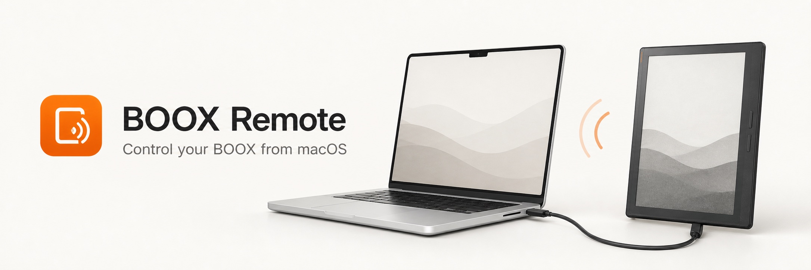
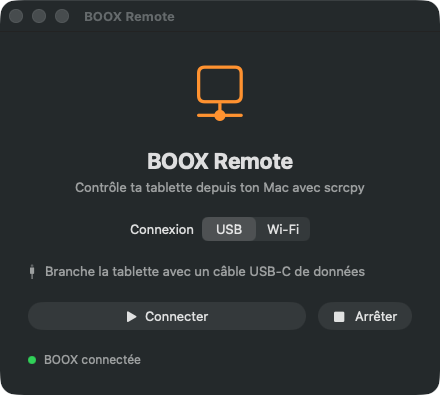
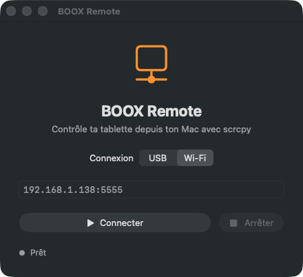

<p align="center">
  
</p>

<p align="center">
  <strong>A tiny native macOS launcher for scrcpy, built for BOOX tablets.</strong>
</p>

<p align="center">
  
  
  
  
</p>

## Screenshots

<table>
  <tr>
    <th>USB connection</th>
    <th>Wi-Fi connection</th>
  </tr>
  <tr>
    <td></td>
    <td></td>
  </tr>
</table>

A lightweight native macOS launcher for controlling a BOOX tablet with [scrcpy](https://github.com/Genymobile/scrcpy), over USB or Wi-Fi. It wraps the usual ADB and scrcpy commands in a simple SwiftUI interface and does not open a Terminal window.

## Features

- USB and Wi-Fi connection modes
- Saved ADB address
- Automatic `adb connect` over Wi-Fi
- Starts scrcpy at 15 FPS without audio
- Start and stop controls without opening Terminal
- Native SwiftUI interface

BOOX Remote does not bundle or modify scrcpy. It launches the copy already installed on your Mac.

## Requirements

- macOS 13 or later
- [Homebrew](https://brew.sh)
- scrcpy and ADB:

```sh
brew install scrcpy
```

## Prepare the tablet

1. Open **Settings → About device** on the BOOX.
2. Tap the build number repeatedly until developer options are enabled.
3. Open **Developer options** and enable **USB debugging**.
4. Connect the tablet once over USB and accept the computer authorization prompt.

The exact menu labels can vary between BOOX firmware versions.

## Build

```sh
chmod +x build.sh
./build.sh
open "build/BOOX Remote.app"
```

The build script uses the Swift compiler and icon tools included with Xcode.

To install the resulting app locally:

```sh
ditto "build/BOOX Remote.app" "/Applications/BOOX Remote.app"
```

## Usage

1. Select **USB** or **Wi-Fi**.
2. For USB, connect a data-capable USB-C cable.
3. For Wi-Fi, enter the tablet's ADB address, for example `192.168.1.138:5555`.
4. Click **Connecter**.

### USB mode

USB is the most reliable option and works without a network. BOOX Remote runs:

```sh
scrcpy --select-usb --no-audio --max-fps 15
```

Use a USB-C cable that supports data, not a charging-only cable.

### Wi-Fi mode

The Mac and tablet must normally be reachable on the same network. Enter the current ADB endpoint in `IP:port` format. BOOX Remote first runs `adb connect`, then starts scrcpy for that device.

Classic TCP/IP debugging commonly uses port `5555`. Android's newer wireless-debugging pairing mode may allocate a different port; use the connection port displayed by Android, not necessarily the pairing port.

Wi-Fi mode does not make the tablet remotely accessible across the internet. Avoid exposing ADB directly on a public IP. For remote access, use a trusted VPN such as Tailscale and restrict access to your own devices.

## Troubleshooting

### “Installe scrcpy avec : brew install scrcpy”

Install the dependency and restart BOOX Remote:

```sh
brew install scrcpy
```

The app detects Homebrew in both `/opt/homebrew/bin` (Apple Silicon) and `/usr/local/bin` (Intel Macs).

### The USB device is not found

Check the connection directly:

```sh
adb devices
```

Reconnect the cable, unlock the tablet, and accept the USB debugging authorization dialog. If the device is listed as `unauthorized`, revoke USB debugging authorizations on the tablet and reconnect it.

### Wi-Fi connection fails

Check that the address has the form `192.168.1.138:5555`, that the tablet is awake, and that both devices can reach each other. Then test:

```sh
adb connect 192.168.1.138:5555
adb devices
```

The tablet's local IP can change after reconnecting to Wi-Fi; update the saved address when necessary.

## Project structure

```text
Assets/AppIcon.svg             App icon source
Sources/BooxRemoteApp.swift    SwiftUI interface and process launcher
Info.plist                     macOS application metadata
build.sh                       Reproducible local build script
```

The app stores the selected connection mode and network address using `AppStorage`. It starts `adb` and `scrcpy` with Foundation's `Process` API and tracks the scrcpy process so it can be stopped from the interface.

## Development

There are no third-party Swift dependencies. To validate the source without producing the full app bundle:

```sh
mkdir -p build/module-cache
swiftc -swift-version 5 -parse-as-library -typecheck \
  -module-cache-path build/module-cache \
  Sources/BooxRemoteApp.swift \
  -framework SwiftUI -framework AppKit
```

Contributions and bug reports are welcome. Please include your macOS version, BOOX model, connection mode, and the output of `adb devices` when reporting a connection issue. Do not include public IPs, ADB keys, or other secrets.

## License

MIT
